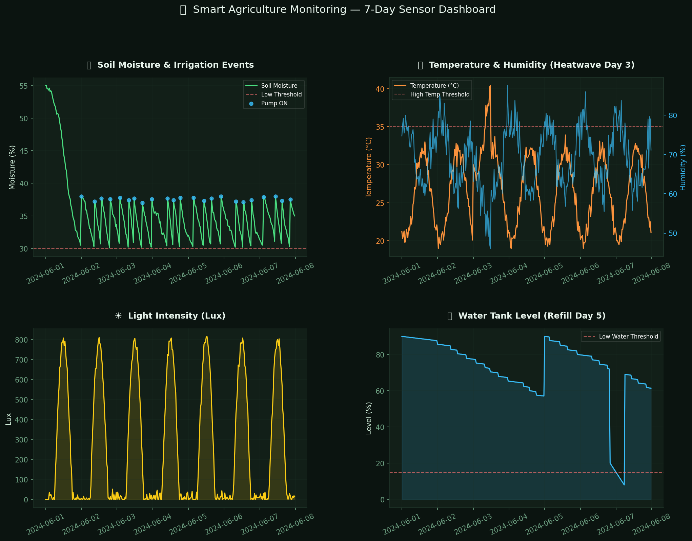
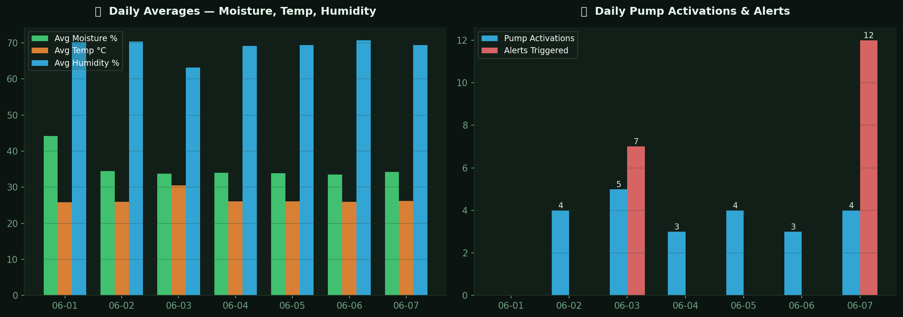
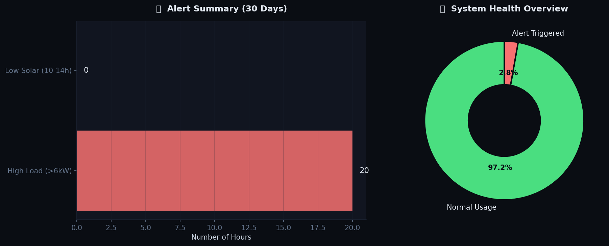

# 🌾 Smart Agriculture Monitoring Dashboard

## 📌 Project Overview

This project simulates a Smart Agriculture Monitoring System using Python.

The system monitors:

* Soil Moisture
* Temperature
* Humidity
* Light Intensity
* Water Tank Level

It automatically triggers irrigation events when soil moisture falls below the threshold and generates alerts for abnormal conditions.

---

## 🚀 Features

* Soil Moisture Monitoring
* Automated Irrigation Logic
* Temperature Monitoring
* Humidity Tracking
* Water Tank Level Monitoring
* Alert Detection System
* Data Visualization Dashboard
* Daily Performance Reports
* System Health Monitoring
* CSV Data Export

---

## 🛠 Technologies Used

* Python
* Pandas
* NumPy
* Matplotlib
* Seaborn
* Jupyter Notebook

---

## 📊 Dashboard Preview

### Main Dashboard

### Daily Summary

### Alert Monitoring

---

## 📁 Project Files

* smart_agriculture_simulation.py
* sensor_data.csv
* chart1_sensor_dashboard.png
* chart2_daily_summary.png
* chart3_hourly_heatmap.png
* chart4_alerts.png

---

## 🔮 Future Improvements

* ESP32 Integration
* Real Sensor Data Collection
* Cloud Database Connectivity
* Mobile Notifications
* MQTT Communication
* Web Dashboard Deployment

---

## 👨‍💻 Author

Aditya
